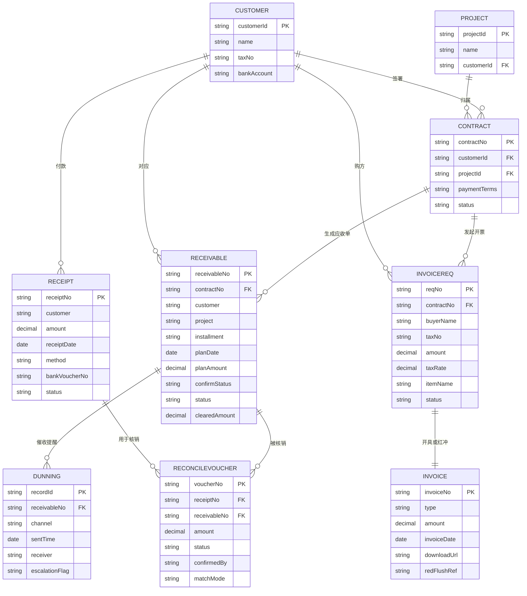

# 结算与开票管理子系统 — 实体关系图（ER Diagram）

> 基于《结算与开票管理子系统需求规格说明书 V1.1》第8章数据字典与第4章业务流程绘制。
> 实体 `CUSTOMER / PROJECT / CONTRACT` 来自上游合同管理子系统，本子系统读取其付款条款与主数据，不负责创建。
>
> ⚠️ 渲染修复说明：Mermaid `erDiagram` 解析器要求实体**属性名必须为 ASCII 标识符**，故属性名使用英文；关系动词标签保留中文。各实体字段的中英文对照见文末「字段对照表」。

## 关系说明（基数与动词）

| 关系 | 基数 | 说明 |
| --- | --- | --- |
| CUSTOMER → CONTRACT | 1 : 0..* | 一个客户可签多份合同 |
| PROJECT → CONTRACT | 1 : 0..* | 一个项目可关联多份合同 |
| CONTRACT → RECEIVABLE | 1 : 0..* | 合同按付款节点生成多张应收单 |
| CONTRACT → INVOICEREQ | 1 : 0..* | 一份合同可发起多次开票申请 |
| RECEIVABLE → RECONCILEVOUCHER | 1 : 0..* | 一张应收单可被多笔核销单部分核销 |
| RECEIPT → RECONCILEVOUCHER | 1 : 0..* | 一笔回款可拆分核销多张应收单 |
| INVOICEREQ → INVOICE | 1 : 1 | 一笔申请开具一张发票（红冲另起关联） |
| RECEIVABLE → DUNNING | 1 : 0..* | 一张应收单可有多条催收/提醒记录 |

## 流程串联（业务主线）

合同生效 → 读取付款条款 → 生成 RECEIVABLE（待销售确认）→ 发起 INVOICEREQ（关联合同）→ 审核通过 → 开具 INVOICE → 客户回款登记 RECEIPT → 系统按客户+合同+金额匹配生成 RECONCILEVOUCHER（会计确认）→ 更新 RECEIVABLE/合同回款状态 → 逾期触发 DUNNING 提醒销售。

## 字段对照表（实体属性 → 中文含义）

**CUSTOMER（客户）**
| 英文字段 | 中文含义 |
| --- | --- |
| customerId | 客户ID（PK） |
| name | 名称 |
| taxNo | 税号 |
| bankAccount | 银行账号 |

**PROJECT（项目）**
| 英文字段 | 中文含义 |
| --- | --- |
| projectId | 项目ID（PK） |
| name | 名称 |
| customerId | 客户ID（FK） |

**CONTRACT（合同）**
| 英文字段 | 中文含义 |
| --- | --- |
| contractNo | 合同号（PK） |
| customerId | 客户ID（FK） |
| projectId | 项目ID（FK） |
| paymentTerms | 付款条款 |
| status | 状态 |

**RECEIVABLE（应收单）**
| 英文字段 | 中文含义 |
| --- | --- |
| receivableNo | 应收单号（PK） |
| contractNo | 合同号（FK） |
| customer | 客户 |
| project | 项目 |
| installment | 期次 |
| planDate | 计划收款日 |
| planAmount | 计划金额 |
| confirmStatus | 确认状态（待确认/已确认） |
| status | 状态（未到期/即将到期/逾期/已结清） |
| clearedAmount | 已核销金额 |

**INVOICEREQ（开票申请）**
| 英文字段 | 中文含义 |
| --- | --- |
| reqNo | 申请号（PK） |
| contractNo | 合同号（FK） |
| buyerName | 购方名称 |
| taxNo | 税号 |
| amount | 金额 |
| taxRate | 税率 |
| itemName | 品名 |
| status | 状态（待审核/通过/驳回/已开票） |

**INVOICE（发票）**
| 英文字段 | 中文含义 |
| --- | --- |
| invoiceNo | 发票号（PK） |
| type | 类型（蓝票/红票） |
| amount | 金额 |
| invoiceDate | 开票日期 |
| downloadUrl | 下载链接 |
| redFlushRef | 红冲关联（原发票号） |

**RECEIPT（回款记录）**
| 英文字段 | 中文含义 |
| --- | --- |
| receiptNo | 回款号（PK） |
| customer | 客户 |
| amount | 金额 |
| receiptDate | 回款日期 |
| method | 方式（电汇/承兑/其他） |
| bankVoucherNo | 银行凭证号 |
| status | 状态（待匹配/已核销/挂账） |

**RECONCILEVOUCHER（核销单）**
| 英文字段 | 中文含义 |
| --- | --- |
| voucherNo | 核销单号（PK） |
| receiptNo | 回款号（FK） |
| receivableNo | 应收单号（FK） |
| amount | 核销金额 |
| status | 状态（待确认/已确认/驳回） |
| confirmedBy | 确认人 |
| matchMode | 匹配方式（自动/手动） |

**DUNNING（催收提醒记录）**
| 英文字段 | 中文含义 |
| --- | --- |
| recordId | 记录ID（PK） |
| receivableNo | 应收单号（FK） |
| channel | 渠道（站内消息/邮件/企微） |
| sentTime | 发送时间 |
| receiver | 接收人（销售） |
| escalationFlag | 升级标记（逾期30天→法务/管理层） |
