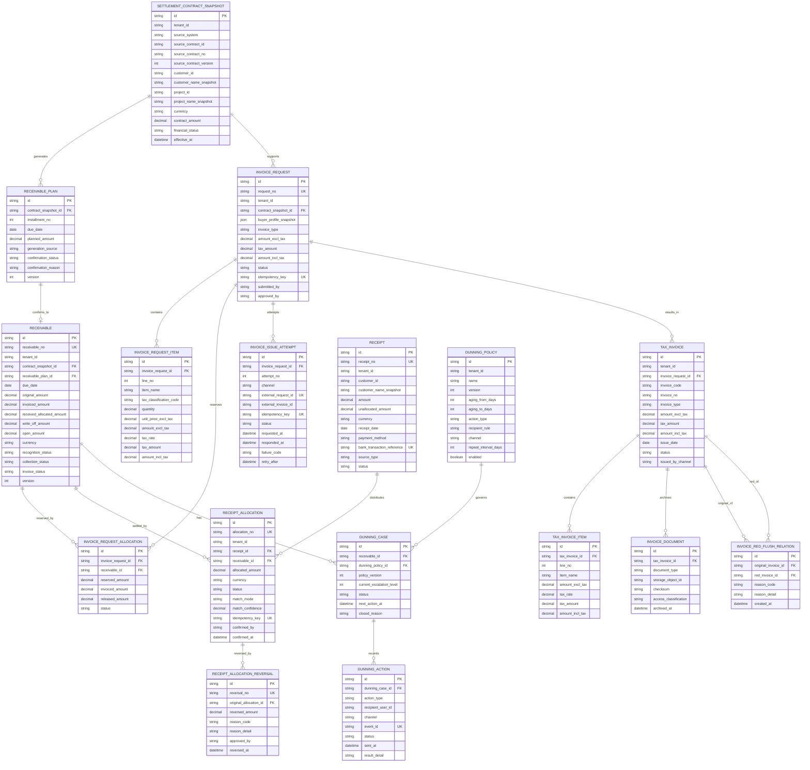

# 结算与开票管理子系统 — 实施级逻辑 ER 图

> 这是结算域自己的逻辑数据模型，而不是把 CRM、合同、项目的数据库表复制进来。客户、项目、合同只以**来源标识 + 不可变业务快照**进入本系统；不得建立跨系统数据库外键。
>
> 所有金额使用 `DECIMAL` 定点数；所有核心表均应包含 `tenant_id`、创建/更新时间、操作者与乐观锁版本等通用字段。图中为突出领域关系，省略了这些重复字段。

> 维护说明：本图描述领域核心关系；`settlement_inbox_event`、`settlement_outbox_event`、`settlement_idempotency_record`、OIDC 会话、审计、通知和 `settlement_report_export_job` 是可靠性/认证/运营支撑表，必须以 `Settlement/migrations/` 的实际 DDL 为准。图中保留的 `TAX_INVOICE_ITEM` 代表设计预留，若迁移尚未创建该表，不得视为已上线能力。



## 关键建模规则

| 领域 | 实施规则 |
| --- | --- |
| 合同、客户、项目 | 通过来源 ID 回溯权威系统；结算单据保存名称、税务资料、付款条款等快照。上游变更不得覆盖已确认应收和已开票凭证。 |
| 应收 | `receivable_plan` 是计划，`receivable` 是已确认的财务义务；开票状态、收款状态、账龄必须分别表达。 |
| 开票 | 一张申请可有多行明细、占用多笔应收，并可产生多次开票尝试和一至多张税务发票。税控调用以 `invoice_issue_attempt` 的外部幂等键重试。 |
| 红冲/作废 | 不修改原发票。红票是新的 `tax_invoice`，并通过 `invoice_red_flush_relation` 连接原蓝票。 |
| 回款核销 | `receipt_allocation` 是最小不可变事实：一笔回款可分配多笔应收，反之亦然。错误以 `receipt_allocation_reversal` 冲销，不能更新或删除原分配记录。 |
| 并发控制 | 确认开票占用或回款分配时，必须在同一数据库事务中锁定相关应收和回款投影，校验余额不为负，并使用 `version` 作乐观锁保护。 |
| 催收 | 策略、案件、动作分离；`dunning_action.event_id` 是通知外发的幂等依据。普通提醒留在本系统；跨系统或高优先级提醒经 Outbox 异步投递基础平台。 |

## 数据库约束与索引（第一期必备）

```text
UNIQUE (tenant_id, source_system, source_contract_id, source_contract_version)
UNIQUE (tenant_id, source_event_id)                         -- 上游事件幂等
UNIQUE (tenant_id, request_no)
UNIQUE (tenant_id, invoice_request.idempotency_key)
UNIQUE (tenant_id, invoice_issue_attempt.external_request_id)
UNIQUE (tenant_id, receipt.bank_transaction_reference)      -- 银行流水去重
UNIQUE (tenant_id, receipt_allocation.idempotency_key)
UNIQUE (dunning_action.event_id)

INDEX  receivable(tenant_id, collection_status, due_date)
INDEX  receivable(tenant_id, customer_id, open_amount)
INDEX  receipt(tenant_id, status, receipt_date)
INDEX  invoice_request(tenant_id, status, created_at)
INDEX  dunning_case(tenant_id, status, next_action_at)
```

已确认的回款分配、冲销、发票及红冲记录只允许追加，禁止物理删除。涉及税号、银行账号、回单和发票文件的数据必须脱敏展示，并记录查看、下载、导出的审计事件。
