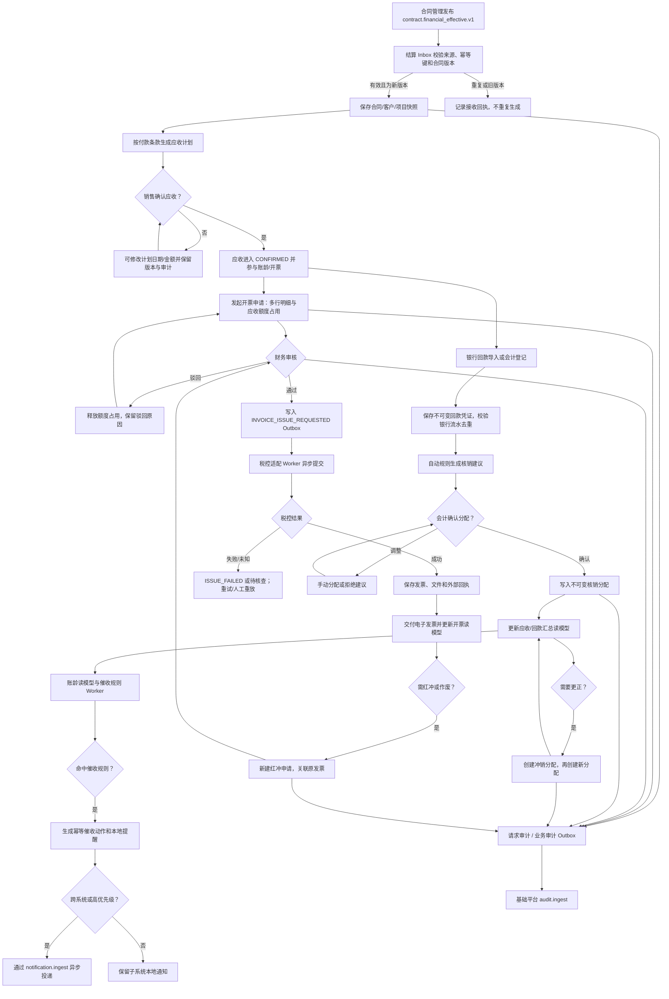

# 结算与开票管理子系统 — 业务流程图

## 关键控制点

1. 合同生效以版本化事件为准；跨系统重复、乱序事件不得重复生成应收。
2. 开票占用的是“可开票额度”，审批驳回或取消必须释放占用。
3. 税控失败不回退审批事实；以可诊断状态、外部流水和重试处理。
4. 回款和核销确认后只能冲销，禁止更新或删除历史金额。
5. 催收通知由规则和幂等动作驱动，不能由页面查询或定时扫描重复发送。
