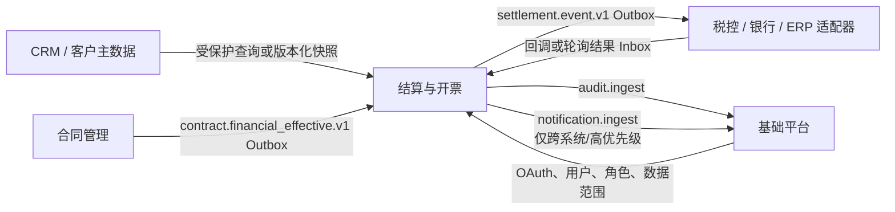
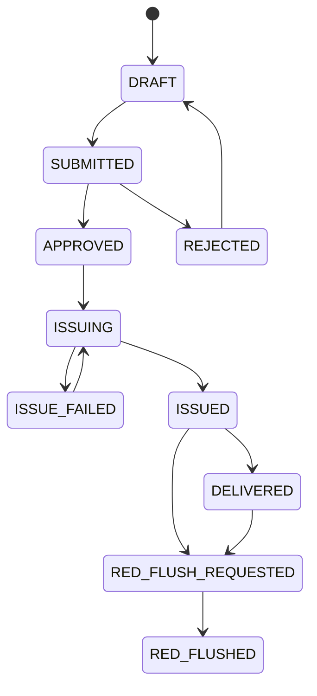

# 结算与开票管理子系统 — 实施设计方案

## 1. 定位与边界

结算与开票是独立的财务业务子系统，负责以下权威事实：

- 合同生效后形成的应收计划、应收确认与账龄；
- 开票申请、审批、税控开具尝试、电子票据、红冲/作废关系；
- 银行回款登记、回款分配、核销确认及冲销；
- 催收规则、催收案件和升级记录；
- 财务操作及外部交互的可审计证据。

它**不**创建或修改客户、项目、合同、组织、用户和角色。上述对象仍由 CRM、项目/合同管理和基础平台负责；本系统只保存带来源和版本号的业务快照。



## 2. 核心原则

1. **金额不可变、分录可冲销**：已确认回款、核销、开票及红冲不得直接改写或删除；修正以冲销/反向分录表达。
2. **上游只读快照**：跨库不得建立物理 FK；每个上游引用必须有 `source_system`、外部 ID、版本和快照时间。
3. **异步外部交互**：合同事件、税控开票、银行导入、ERP 同步均经 Outbox/Inbox，HTTP 请求不等待外部完成。
4. **幂等优先**：所有命令有 `idempotency_key`；所有外部事件有稳定 `event_id`；回调有第三方流水唯一键。
5. **分权与审计**：申请、审批、开具、核销确认、冲销不能由同一职责无约束完成；所有高风险操作写审计。
6. **读写分离**：经营看板、账龄、TOP N 属于读模型/汇总，不作为账务事实来源。

## 3. 上游合同接入

合同管理系统只在合同达到财务生效状态后发布 `contract.financial_effective.v1`。事件至少包含：

```json
{
  "event_id": "...",
  "event_type": "contract.financial_effective.v1",
  "tenant_id": "...",
  "contract_id": "...",
  "contract_no": "...",
  "contract_version": 12,
  "customer": {"id": "...", "name": "...", "tax_no": "..."},
  "project": {"id": "...", "name": "..."},
  "currency": "CNY",
  "payment_terms": [{"sequence": 1, "due_date": "2026-09-30", "amount": "100000.00"}],
  "occurred_at": "2026-08-24T12:00:00Z"
}
```

结算系统用 `(tenant_id, source_system, source_event_id)` 去重，并仅接受大于当前快照版本的合同事件。撤销、变更、终止合同使用独立事件类型，不能由旧的生效事件覆盖。

当前实现边界：合同管理虽提供受保护的 `GET /internal/v1/settlement/completed-contracts` 摘要接口，但结算当前不以轮询该接口作为自动同步机制。正式联调必须使用带付款条款的 `contract.financial_effective.v1` 事件或明确的补偿任务；只有合同完成、没有付款条款或没有应收确认时，发票可选应收为空是正确结果。

## 4. 领域模型

### 4.1 应收

合同生效事件创建 `receivable_plan`，销售在权限范围内确认后生成可参与催收、开票与核销的 `receivable`。应收使用 `DECIMAL(18,2)` 与 `currency`；展示金额可四舍五入，账务计算不得使用浮点数。

```text
receivable.plan_amount
receivable.invoiced_amount     ← 发票分配汇总
receivable.cleared_amount      ← 已确认核销分配汇总
receivable.open_amount         = plan_amount - cleared_amount
receivable.invoiceable_amount  = eligible_amount - invoiced_amount - invoice_reserved_amount
```

### 4.2 开票

开票申请可包含多条服务/商品明细，并通过 `invoice_request_receivable_allocation` 占用可开票额度。审核通过后创建异步开具任务；税控回执、电子发票文件和红冲关系独立保存。



`ISSUE_FAILED` 不代表可自由新建第二张发票，必须先确定外部税控是否已受理；每次提交由 `invoice_issue_attempt` 持久化幂等键和外部流水号。税控投递成功只进入 `ACCEPTED`，最终结果由独立机器身份回调或状态查询对账写入 `tax_result_inbox`；UNKNOWN 必须复用原 external request，终态禁止回退。人工模式与税控模式互斥，人工模式下不得批准红冲。

红冲由独立 `invoice_red_flush_attempt` 跟踪。成功结果追加负数红票、实际票面明细、蓝红票关联与 allocation reversal，原蓝票事实不删除；重复、乱序和载荷冲突均保留 Inbox 证据并按 Provider 序号裁决。

### 4.3 回款与核销

回款是银行流水或人工登记的原始凭证；核销是回款与应收之间的不可变分配。一个回款可以分配到多张应收，一张应收也可以由多笔回款结清。

```text
receipt
  └── receipt_allocation (receipt_id, receivable_id, amount, status)
        └── receipt_allocation_reversal (reversed_allocation_id, reason)
```

自动匹配只生成 `PROPOSED` 分配建议，并记录匹配规则版本和置信度。会计确认后才变为 `CONFIRMED`；发生错误时创建冲销分配后重新分配。

### 4.4 催收与经营读模型

账龄由已确认应收和已确认核销计算；催收使用可版本化规则，而非硬编码“逾期 1 天/30 天”。同一规则、应收、升级级别仅产生一次幂等催收动作。看板、TOP N、账龄区间由异步读模型生成。

## 5. 集成与可靠性

| 场景 | 推荐实现 | 关键要求 |
|---|---|---|
| 合同生效 | 合同 Outbox → 结算 Inbox | event_id 去重、合同版本单调递增 |
| 税控开具 | 结算 Outbox → 税控适配 Worker | 外部幂等键、回调验签、失败/未知状态 |
| 银行回款 | 文件导入或银行适配 Inbox | 银行流水唯一键、原始文件留存、重复拒绝 |
| ERP/总账 | 已确认分录 Outbox | 期间、批次、对账结果及重放能力 |
| 审计 | 请求审计 Outbox → 平台 `audit.ingest` | 不含账号、税号、完整银行号等敏感原文 |
| 重要通知 | 本地 Outbox → 平台 `notification.ingest` | 仅跨系统/HIGH/CRITICAL，使用平台 USER ID |

所有 Worker 使用已有的 MySQL 租约、`SKIP LOCKED`、指数退避、死信和人工重放模式。外部不可用只将业务对象置于可诊断的中间状态，不能回滚已经确认的财务事实。

报表查询必须走读模型或受控汇总；账龄导出采用异步 CSV 任务，不在 HTTP 请求中同步生成大文件。前端看板按页面分区加载目标接口，并用请求代次丢弃过期响应；单个接口失败必须在正式实现中可见，不能用旧状态静默替代。

## 6. 授权、数据范围与安全

建议建立独立权限，而非复用合同/CRM 的业务权限：

| 权限域 | 典型权限 |
|---|---|
| 应收 | `settlement.receivable.read`、`settlement.receivable.confirm` |
| 开票 | `settlement.invoice.read`、`settlement.invoice.request`、`settlement.invoice.approve`、`settlement.invoice.issue` |
| 回款与核销 | `settlement.receipt.record`、`settlement.allocation.confirm`、`settlement.allocation.reverse` |
| 催收与报表 | `settlement.dunning.manage`、`settlement.report.read`、`settlement.report.export`、`settlement.notification.read` |

以上权限以 `authz/permission-manifest.json` 为执行权威；设计稿中的旧名称不得用于接入、前端判断或平台目录同步。
| 配置与集成 | `settlement.policy.manage`、`settlement.integration.operate` |

数据范围按租户、组织、合同负责人/项目负责人和财务岗位实现。税号、银行账号、身份证明、电子票文件默认脱敏；查看完整值、下载、复制、导出均需额外权限和审计。

## 7. 审计与期间控制

以下操作必须是高风险审计事件：开票审核、税控提交、人工补票、红冲、回款登记、核销确认、核销冲销、导出完整财务数据、催收升级规则变更。

后续支持财务期间：关闭期间后禁止新增/变更分录，只能用新的调整期间和冲销分录修正。报表导出记录筛选条件、生成时刻、操作者和文件校验值。

## 8. 分期实施

### MVP

- 合同生效 Inbox、合同快照、应收计划与销售确认；
- 开票申请、多明细、财务审核、人工开票登记和受控文件归档；
- 回款登记、人工/建议核销、部分核销、冲销；
- 基础账龄、内部催收、审计与本地通知；
- 全部写命令幂等、全部跨系统交互 Outbox/Inbox 化。

### 第二期

- 银行流水导入和自动匹配建议；
- 真实税控/金税 Provider 沙箱联调、供应商签名验收和明确失败后的受控人工重试；
- 电子票自动交付与部分红冲（当前仅支持整票红冲）；
- 跨系统高优先级通知。

### 第三期

- ERP/总账对接、财务期间锁定、月结与对账；
- 多币种、汇兑、坏账与高级账龄预测；
- 可配置催收策略和经营读模型扩展。

## 9. 上线门槛

上线前必须完成：合同事件契约评审、税控/银行供应商边界确认、数据分类分级、财务权限矩阵、金额并发核销测试、事件重复/乱序测试、外部回调重放测试、审计抽查及财务人员验收。

当前代码级生产门禁还包括：

- `GET /auth/logout` 不得执行改变状态的登出操作；统一退出需完成 OIDC RP-initiated logout 和严格校验的 post logout URI；
- 明确 `invoiceable_amount` 是否受 `open_amount`、核销和冲销影响，并补齐边界测试；
- 看板不同权限下的部分失败、路由切换竞态和重复加载必须有行为测试，而不只依赖静态源码断言；
- 真实数据库测试必须通过合同事件→付款条款→应收确认→发票申请完成，不得直接插入模拟应收绕过业务校验。

已落实的查询安全门禁：合同快照、应收、催收案件之间的 JOIN 同时绑定租户；所有数据库行流在返回成功前检查 `rows.Err()`，避免跨租户脏关联和部分结果被误报为完整 200。
